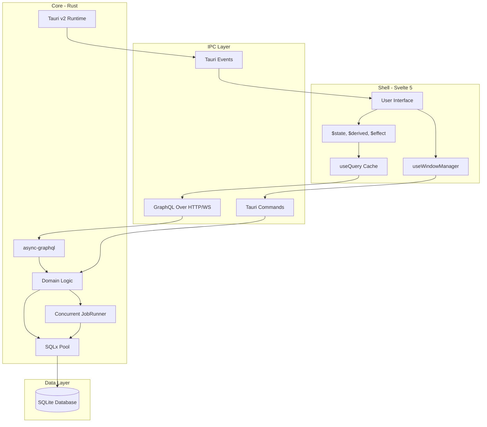

# System Map

## Visual Architecture

## High-Level Overview
This project is a local-first desktop application built with **Tauri v2**, **Rust**, and **Svelte 5**.

### 1. The Core (Backend)
- **Language:** Rust
- **Framework:** Tauri v2
- **Persistence:** SQLite via SQLx
- **API:** GraphQL (async-graphql) served via Axum
- **Logging:** Structured tracing via the `tracing` crate

### 2. The Shell (Frontend)
- **Language:** TypeScript / Svelte 5
- **Reactivity:** Svelte 5 Runes ($state, $derived, $effect)
- **UI Primitives:** Bits UI + Standardized wrappers (ViewShell, PropertyRow)
- **Styling:** SCSS with a tokenized design system

### 3. The Boundary (IPC)
- **Commands:** Strongly typed Rust functions invoked from the frontend.
- **Events:** Asynchronous message passing from Rust to Frontend (e.g., settings updates).
- **Security:** Scoped permissions and capabilities defined in `backend/capabilities/`.

## Maintenance & Regeneration
To ensure this map remains "The Source of Truth," use the following tools to audit the actual codebase structure:
- **Backend Audit:** `cargo modules generate graph`
- **Frontend Audit:** `npx depcruise --output-type mermaid src`
- **Tidiness Check:** `fd --max-depth 2`

